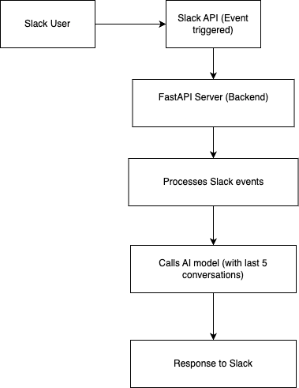

# Slack Chatbot App - Your_Name's Droid

A chatbot app named Slack that listens to any questions in a channel (where the bot is added & tagged), forwards them to an LLM API (such as Ollama or OpenAI), and responds to the message accordingly.

## Technologies Used

- **Python**
- **FastAPI**
- **Slack SDK**
- **Ollama** (for using `smollm:135m`)
- **Docker**
- **ngrok** (for generating a public URL, used for event triggers in Slack)

---

## Setup and Installation Steps

### Step 1: Install `ngrok` on your local machine

#### 1.1 Install `ngrok`

**For Linux:**

```bash
curl -sSL https://ngrok-agent.s3.amazonaws.com/ngrok.asc \
| sudo tee /etc/apt/trusted.gpg.d/ngrok.asc >/dev/null \
&& echo "deb https://ngrok-agent.s3.amazonaws.com buster main" \
| sudo tee /etc/apt/sources.list.d/ngrok.list \
&& sudo apt update \
&& sudo apt install ngrok
```
**For mac:**
```bash
brew install ngrok
```

#### 1.2 Setup ngrok authentication
1. Sign up for an ngrok account at ngrok dashboard
2. Retrieve your authentication token `<your_ngrok_authtoken>`
3. Add your authentication token:
    ```
    ngrok config add-authtoken <your_ngrok_authtoken>
    ```

### Step 2: Running Locally

#### 2.1 Clone the Repository
```
git clone https://github.com/subhamyadav580/slack-bot-app
cd slack-bot-app
```

#### 2.2 Add Environment Variables
Create a `.env` file in the project directory and add the following:

```
SLACK_TOKEN=<YOUR_APP_SLACK_TOKEN>
SIGNING_SECRET=<YOUR_APP_SIGNING_SECRET>
```

#### 2.3 Build the Docker Image
```
docker build -t slack-bot-app .
```

#### 2.4 Run the Docker Container
```
docker run -d -p 8000:8000 --name slack-bot-app-container slack-bot-app
```

#### 2.5 Expose the Local Server Using ngrok
```
ngrok http http://localhost:8000
```

After running the above command, you will get a public URL like this:

```
https://11ed-223-190-84-209.ngrok-free.app
```
This URL will be used to access your local server publicly.

#### 2.6 Configure Slack Event Subscriptions

Go to your Slack App settings and update the Event Subscriptions section with the public URL obtained from ngrok. Append `/slack/events` to it:

```
https://11ed-223-190-84-209.ngrok-free.app/slack/events
```


## Architecture Design Diagram

